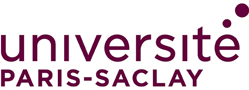
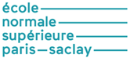
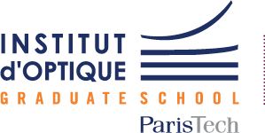

**ATSI** (for _Automatique, Traitement du Signal et des Images_ in French) is a
second and final year of Master degree of Université Paris-Saclay. It aims at
giving students training to address scientific and R&D topics in the domains
of
- systems and control,
- signal & image processing, and
- the foundations of machine learning with statistical learning, estimation or optimisation.

The back-to-school amphitheater will be held on Friday, September 5, 2025.
{: .notice--warning}



This _curriculum_ allows acquiring solid skills in these themes but also to
understand interactions with other related disciplines like autonomous vehicles,
machine learning or AI, computer vision, data processing..., whether theoretical
or applied. After graduating from ATSI, students can continue with doctoral
studies in academic or industrial environments or pursue a job in industrial
research and development.

# Paris-Saclay University

Paris-Saclay University is a French federal research university, integrating
several leading public universities, grandes écoles, and research centers (CNRS,
CEA, INRIA, Onera…). It is located in the Saclay area, 20 km south of Paris,
which also hosts research centers of private companies and comprises nearly 15%
of French scientific research capacity.

# Contacts

<!-- - Program chairs: François Orieux and Hugues Mounier ([email](email:master2rec-atsi.sciences@universite-paris-saclay.fr)) -->
- Program chairs: [François Orieux](mailto:francois.orieux@universite-paris-saclay.fr) and [Hugues Mounier](mailto:hugues.mounier@universite-paris-saclay.fr)
- Secretary: [Emmanuel Ghomsi Ghomsi (interim)](mailto:emmanuel.ghomsi-ghomsi@universite-paris-saclay.fr)
- [Institutional webpage]( https://www.universite-paris-saclay.fr/formation/master/electronique-energie-electrique-automatique/m2-automatique-traitement-du-signal-et-des-images)

# Supporting institutions

- [Université Paris-Saclay](https://www.universite-paris-saclay.fr/formation/master/electronique-energie-electrique-automatique/m2-automatique-traitement-du-signal-et-des-images)
- [École Normale Supérieure Paris-Saclay](http://ens-paris-saclay.fr/)
- [CentraleSupélec](http://www.centralesupelec.fr/)
- [Institut d’Optique Graduate School](https://www.institutoptique.fr/)
- Labelled by [DATAIA Institute](https://dataia.eu/) as training programs in AI.

{:refdef: style="text-align: center;"}
&nbsp;&nbsp;&nbsp;&nbsp;
{: refdef}
